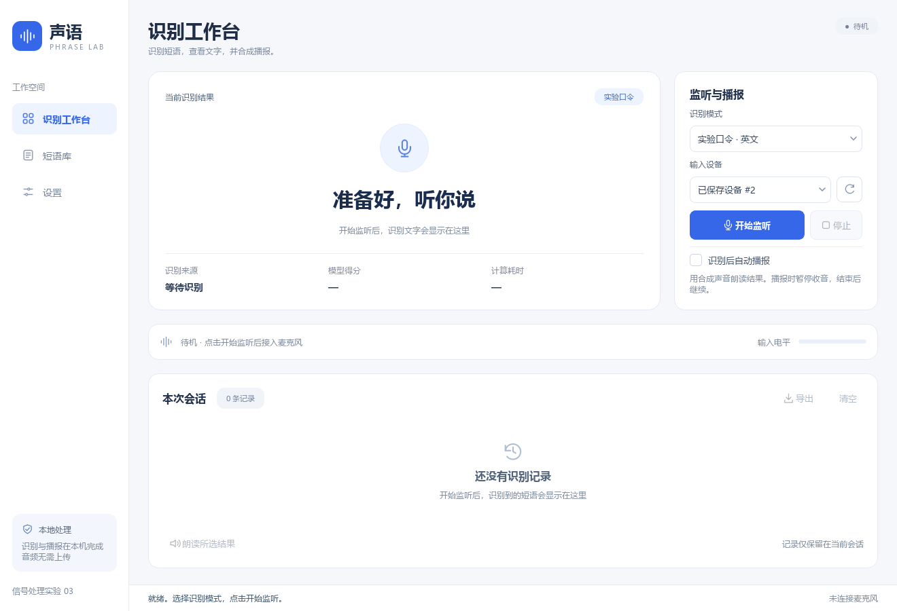

# 车内短语识别模块

本项目实现 PC 上的短语识别、文字显示和文字合成播报。使用 VS Code 开发，硬件只使用本机麦克风、声卡和扬声器。

**当前状态：本机中文识别与合成播报已联调；按用户最新选择，短语和设置恢复为停止监听后修改。英文漏识别正在通过离线对照和真人复测改进。** 功能联调和用户反馈不等于标准测试集准确率或端到端延迟统计。静态检查、外观检查与功能验证分别记录。

## 应用界面

采用浅色背景、白色卡片、蓝色强调色和左侧导航，分为识别工作台、短语库、设置三个页面。工作台集中展示识别结果、监听控制和会话记录；短语库提供搜索和编辑；参数与模型说明放在设置页。较小窗口支持滚动查看。



[短语库预览](docs/ui/phrases.png) · [设置页预览](docs/ui/settings.png) · [界面设计与检查说明](docs/05-界面设计与排版检查.md)

## 功能

- 实验模式：Log-Mel + 原课程参数 BC-ResNet，保留十个英文命令词以及静音/未知分类。
- 默认选择实验模式，短语库预置 `down、go、left、no、off、on、right、stop、up、yes`；静音和未知属于识别状态，不加入可朗读的短语列表。用户后续保存的模式与短语在重启后保留。
- 自定义模式：编辑、启停、导入、导出中文及英文短语；流式检测命中的设定短语，不转写任意句子。
- 监听、播报及等待停止期间锁定短语和设置；完全停止后可以修改，保存后手动开始监听。停止与重新开始保留会话记录和自动播报选择；自定义模式没有启用短语时禁止启动。
- 显示识别文字、模型得分（可用时）、计算耗时和会话历史，手动导出 CSV。
- Windows SAPI 根据识别文字合成新声音；不会回放麦克风原音。
- 播报期间暂停识别输入，余音等待后继续，避免识别器重复听见自己的播报。
- 启动后处于待机，不自动录音；自动播报每次默认关闭。没有专门的图书馆模式或音频解锁流程。

## 设计文档

1. [架构设计](docs/01-架构设计.md)
2. [详细设计](docs/02-详细设计.md)
3. [操作与后续验证](docs/03-操作与后续验证.md)
4. [静态检查记录](docs/04-静态检查记录.md)
5. [界面设计与排版检查](docs/05-界面设计与排版检查.md)
6. [实机与交互验证](docs/06-实机与交互验证.md)
7. [英文漏识别调整与待验证项](docs/07-英文漏识别调整.md)

## 当前机器

已创建 `.venv`，复用本机已有 Python 包以避免重复安装较大的依赖，新依赖安装在项目虚拟环境内。依赖版本固定在 `requirements.txt`。C++ 编译器使用本机 MinGW，生成 `build/phrase_lab_core.dll`。自定义模型数据已放入 `models/custom/`。

原始 `课程资料/` 保持原样。`native/generated/weights.hpp` 是由原始 `table.c` 提取的数据派生文件，包含来源 SHA-256；不能用该文件的静态存在来证明识别正确。

## 启动

在本工作区 PowerShell 终端运行：

```powershell
powershell -ExecutionPolicy Bypass -File .\run.ps1
```

也可以在 VS Code 选择“打开短语识别界面（不自动录音或播报）”调试配置。第一次使用调试配置需安装 VS Code 的 Python 与 Python Debugger 扩展；直接运行不依赖这些扩展。

启动仅打开界面。点击“开始监听”会真正使用麦克风；勾选“识别后自动播报”后，识别成功会从扬声器出声；“朗读所选结果”也会出声。

## 重建环境

```powershell
powershell -ExecutionPolicy Bypass -File .\scripts\setup.ps1
```

若本机代理使 pip 安装失败，可使用本进程直接访问 PyPI 的安装选项，它不修改系统代理：

```powershell
powershell -ExecutionPolicy Bypass -File .\scripts\setup.ps1 -Direct
```

只编译和静态检查，不打开音频设备：

```powershell
.\.venv\Scripts\python.exe scripts/build_native.py
.\.venv\Scripts\python.exe scripts/static_check.py
```

安装脚本不会启动应用或播放声音。模型下载需要网络，正常识别与系统 TTS 均为本机处理。Qt、sherpa、系统声音与模型各自遵循其来源许可；本项目不重新声明第三方参数的授权。

## 初次使用顺序

先在识别工作台点击停止，等待监听与播报结束，再进入短语库修改；保存后手动开始监听。自定义短语使用普通汉字、英文字母、空格和英文撇号；数字请写成汉字，英文词典外词可通过高级词元修正。重复短语和无效发音会在编辑弹窗内提示。

当前机器应选择“麦克风阵列 (Realtek(R) Audio)”。系统默认输入曾为“立体声混音”，它不是收录人声的麦克风。识别引擎所需的运行文件会复制到本用户的 `%LOCALAPPDATA%/PhraseLab/runtime/`，避免第三方引擎无法打开中文工作区路径；课程资料与项目模型源文件保持不变。

实验模式已有类别固定，自定义短语表只在自定义模式生效。“停止”同时停止收音并取消当前播报。关闭窗口会等待后台任务退出。播报期间说的新短语不会被接收，应等播完后继续。

为改善自定义模式的英文漏识别，自定义触发阈值从 0.35 调整为 0.25，有声电平阈值从 0.008 调整为 0.004；当前保存配置同步更新，保留用户新增短语。用户最新要求暂停测试，因此本轮最终配置尚未真人复测，也未重新启动应用。

模型计算耗时不包含音频等待和播报时间，模型得分也不是校准后的准确率。只有独立带标签数据评估才能报告准确率；当前没有这样的统计结果。
