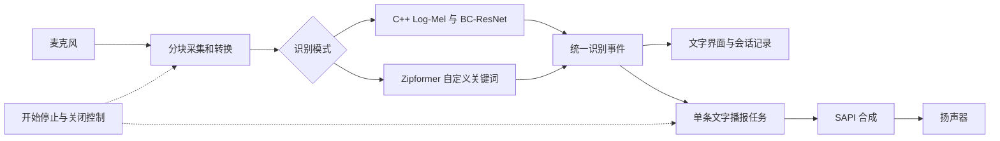

# 车内短语识别模块架构设计

本项目使用 PC 自带麦克风、声卡和扬声器，在 Windows 上本地识别短语、显示文字，并从文字合成播报。开发环境为 VS Code。本文先于详细设计和实现编写。

## 需求与边界

- 实验模式：保留 `_silence_、_unknown_、down、go、left、no、off、on、right、stop、up、yes`，使用指导书的 Log-Mel 与 BC-ResNet 路线以及提供的参数。
- 自定义模式：用户新增、编辑、删除、启停中文或英文短语，命中后显示所配置的短语文字。使用支持自定义关键词的流式模型，不宣称能够转写任意句子或理解指令意图。
- 输出：文字为播报的唯一输入，使用 Windows SAPI 合成新语音，不能将录音接到播放设备。
- 原始课程资料保持不变；所有新增代码、配置、模型和文档放在独立目录。
- 首轮按用户要求不发声、不进行功能测试。用户随后明确授权连接麦克风与扬声器，并完成了真人口令及播报联调。当前允许在本机继续验证与修复交互。
- 按用户最新要求，不开发专门的图书馆模式。每次启动不自动录音，自动播报默认关闭；点击开始监听后才接入麦克风。
- 延迟与准确率属于待测指标，不把论文数据当作本项目实测结果。

## 分层与技术选择

| 层 | 职责 | 技术 |
|---|---|---|
| 界面 | 模式、短语、参数、状态、结果和导出 | Python 3.11 + PySide6 |
| 应用控制 | 生命周期、线程、显式开始停止、播报互锁 | Python，工作线程与 Qt 信号 |
| 音频输入 | 设备选择、分块读取、必要的采样率转换 | sounddevice / PortAudio + NumPy |
| 实验识别 | 16 kHz / 40 Mel / BC-ResNet / 12 类 | C++17 动态库，Python ctypes |
| 自定义识别 | 中文拼音与英文音素词表、流式关键词检测 | sherpa-onnx CPU + 本地中英文 Zipformer 模型 |
| 文字播报 | 根据最终文字生成新语音，异步等待与取消 | Windows SAPI / pywin32 |
| 持久化 | 短语、参数、模型来源、手动结果导出 | JSON / CSV（UTF-8 BOM） |

界面使用 Python 是为了简化短语编辑和状态交互；实验的特征计算与神经网络推理保留为可编译、可检查的 C++ 核心。识别模式通过同一接口替换，界面与音频不依赖某个网络。

## 数据流

不存在“原始录音 → 扬声器”的通路。实验模式的分数是 softmax 模型得分，不宣称为校准的正确概率；自定义模型没有可直接比较的句级置信度时显示空值，不编造分数。

## 状态与互锁

会话状态：待机 → 加载 → 监听 → 播报中 → 余音等待 → 监听；用户停止、切换模式或关闭窗口时停止当前任务。故障显示文字原因，不发出提示音。

默认采用轮流收音与播报。进入播报前立即禁止识别线程接收新音频并清空待处理块；播报结束后保持短暂抑制，重置识别缓存，再允许下一句。用户在播报期间说话不会被处理，界面需要明确显示这一限制。暂不实现边播边说的回声消除。

自动播报是独立开关，默认关闭。点击停止时停止麦克风并取消正在进行的 SAPI 任务。应用启动、模型加载、短语保存都不能触发播报。关闭窗口后不得再启动音频任务。

## 模型和数据

- 原始 `课程资料/新版/table.c` 只读，构建前按明确边界提取参数并记录 SHA-256，解决其与样例重复定义的问题。
- 自定义模式下载官方中英文 3M 关键词模型，选择 chunk-8、INT8 encoder/joiner 和 FP32 decoder；这里只是初始部署选择，性能尚未验证。
- 中文短语转换为带声调拼音音素；英文单词使用模型随附音素词典。不能转换的输入给出明确错误，不静默丢掉单词。
- 监听或播报时锁定短语、模式、设备和设置；完全停止后允许编辑。保存先完成校验，下次用户手动开始监听时创建识别器。
- 不自动保存录音，不上传音频。文字记录先留内存，用户手动导出；设置保存在 workspace 的 `data/settings.json`。

## 实验验收与扩展

实验模式保留规定类别、采样率、算法设计和性能统计入口。自定义模式为扩展，测试结果分别报告。静音/未知状态不得用自定义关键词的空结果直接混同，需要结合有声段状态。

计划后续验证：预处理数值、逐层/分类结果、12 类混淆矩阵、真人口令漏检与误触发、噪声条件、显示延迟、播报启动时间和设备异常。已完成的基础联调和交互回归见《06-实机与交互验证》。

## 参考资料

- 本地指导书第 3.4 节，书内 163—183 页。
- https://k2-fsa.github.io/sherpa/onnx/kws/index.html
- https://k2-fsa.github.io/sherpa/onnx/kws/pretrained_models/index.html
- https://learn.microsoft.com/en-us/previous-versions/windows/desktop/ms723609(v=vs.85)
