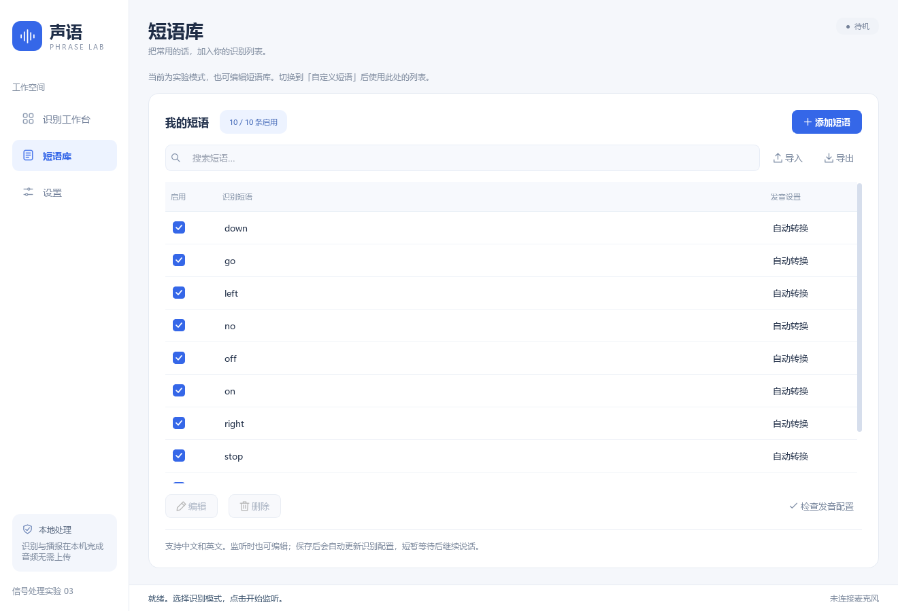
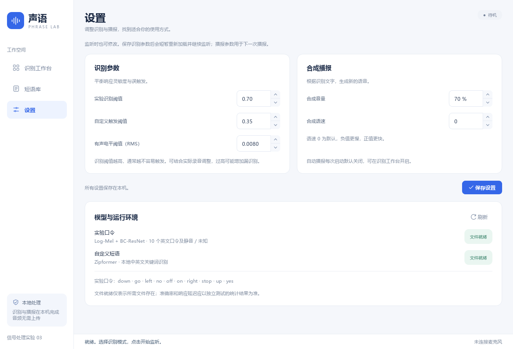

# 界面设计与排版检查

本次将桌面应用整理为三个页面，保持现有识别与播报接口。没有增加图书馆模式、解锁步骤或自动音频任务。

## 页面

- **识别工作台**：突出当前文字结果；监听和播报控制放在右侧，会话记录放在下方。尚无结果时显示空状态，不填充虚构识别记录。没有记录时禁用导出和清空，没有选择可朗读记录时禁用朗读按钮。
- **短语库**：支持搜索、启停、添加、编辑、删除、导入、导出和发音配置检查。编辑弹窗默认隐藏高级词元，勾选“手动设置发音”后显示。
- **设置**：识别阈值、播报音量和语速分组显示，模型文件状态与技术说明集中放在此页。

## 视觉规范

背景使用 `#f5f7fb`，卡片为白色，主按钮与导航选中态使用 `#3567e8`。使用统一的圆角、细边框、中文字体和本地矢量图标。主界面优先保留操作信息，模型得分与计算耗时的解释通过鼠标提示提供。

`app/phrase_lab/appearance.py` 管理样式、字体和图标，`layout.py` 管理三个页面的结构，`ui.py` 管理界面事件。窗口内容可滚动，小窗口不会把操作永久挤出可访问区域。

## 已完成的外观检查

通过 `scripts/render_ui_preview.py` 使用 Qt 的 `offscreen` 平台绘制实际组件，检查了 1320 × 900 的三个页面、1060 × 700 的工作台，以及短语编辑弹窗。根据预览修正了离屏字体缺失、图标缩放、品牌文字截断、下拉箭头、复选框与数字调节控件的显示。

预览过程未创建可见桌面窗口。脚本禁止导入音频和模型依赖，并禁止启动识别及播报线程；没有调用麦克风、声卡查询、模型推理、TTS 或扬声器，没有导出识别记录或保存用户设置。预览图片中的短语来自默认配置，识别记录保持为空。

这些图片用于外观审查，不代表识别效果、音频兼容性或业务交互已通过测试。

## 实际组件预览

### 识别工作台

### 短语库

### 设置

### 小窗口与编辑弹窗

[1060 × 700 工作台](ui/compact.png) · [短语编辑弹窗](ui/phrase-dialog.png)
